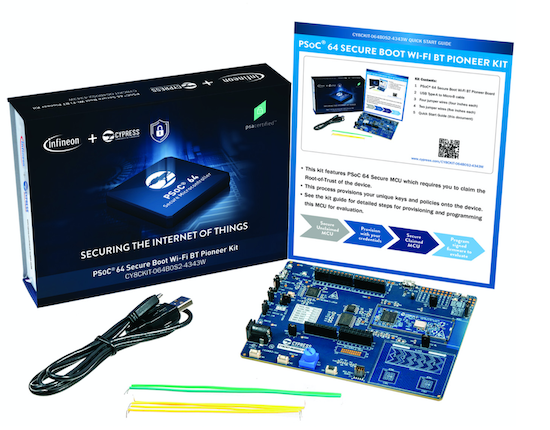
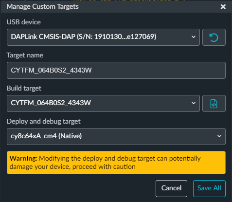

# Running Device Management Client example on the PSoC® 64 Secure Boot Wi-Fi BT Pioneer Kit (CYTFM_064B0S2_4343W)

This document guides you through all of the steps required to run Device Management Client example on the CYTFM_064B0S2_4343W target.

- [Prerequisites](#prerequisites).
- [Cloning the example](#cloning-the-example).
- [Provisioning the device with initial credentials](#provisioning-the-device-with-initial-credentials).
- [Generating and provisioning Device Management credentials](#generating-and-provisioning-device-management-credentials).
- [Building and running the example](#building-and-running-the-example).
- [Updating firmware](#updating-firmware).

## Prerequisites

- [Arm Mbed Studio](https://os.mbed.com/studio/)
- Install the `libusb` dependency for pyOCD based on the [Cypress documentation](https://www.cypress.com/file/502721/download#page=19&zoom=100,96,382).

    **Note:** Due to a known issue, Cypress recommends using [`libusb` version 1.0.21](https://github.com/libusb/libusb/releases/tag/v1.0.21) on Windows instead of the most recent version.
- OpenSSL toolkit (Windows only)
     - For windows the [SLP distribution](https://slproweb.com/products/Win32OpenSSL.html) will suffice and the PATH env should be updated to point to the installation.)

## Importing the example in Mbed Studio

1. [Import](https://os.mbed.com/docs/mbed-studio/current/create-import/index.html) the code repository to Mbed Studio:


## Install Cypress Tools
Open a terminal inside Mbed Studio (Terminal... New Terminal) and install CySecureTools:

    ```
    pip install cysecuretools
    ```

## Provisioning the device with initial credentials

You need to carry out this step only once on each board to be able to re-provision later with your root CA and device certificate.

1. In the Mbed Studio terminal, set up your project workspace for CySecureTools and create keys for provisioning:

    ```
    cd ./mbed-os/targets/TARGET_Cypress/TARGET_PSOC6/TARGET_CYTFM_064B0S2_4343W
    cysecuretools -t cy8ckit-064b0s2-4343w init
    cysecuretools -t cy8ckit-064b0s2-4343w -p policy/policy_multi_CM0_CM4_tfm.json create-keys
    ```

    You will be prompted to overwrite existing files. Type `y` to continue.

1. Unplug your device from the power supply.
1. Remove the jumper shunt from J26.
1. Plug in power.
1. Press the Mode button until the LED is blinking at 2 Hz to put the device in DAPLink mode.
1. To provision the board with basic configuration, run:

    ```
    cysecuretools -t cy8ckit-064b0s2-4343w -p policy/policy_multi_CM0_CM4_tfm.json provision-device
    ```
1. Unplug your device from the power supply.
1. Put back the jumper shunt back in J26.
1. Plug in power.

    **Note:** You don't need the keys and other files that were just created. At this point, you can delete these files.

For more information about the initial provisioning process, please see ["Provision the Device" section of the CY8CKIT-064B0S2-4343W PSoC 64 Secure Boot Wi-Fi BT Pioneer Kit Guide](https://www.cypress.com/file/502721/download#page=30&zoom=100,96,382).

## Generating and provisioning Device Management credentials

1. Navigate to the `mbed-os-example-pelion/TARGET_CYTFM_064B0S2_4343W` directory.

1. Create a `certificates` directory:

    ```
    mkdir certificates
    ```  

1. Name your own root CA private key and certificate `rootCA.key` and `rootCA.pem` respectively, and place them in the `TARGET_CYTFM_064B0S2_4343W/certificates` directory.

    Alternatively, if you don't have a root CA, you can generate a root CA private key and certificate using the [OpenSSL toolkit](https://www.openssl.org/):

    ```
    openssl ecparam -out certificates/rootCA.key -name prime256v1 -genkey
    ```

    ```
    (echo '[ req ]'; echo 'distinguished_name=dn'; echo 'prompt = no'; echo '[ ext ]'; echo "basicConstraints = CA:TRUE"; echo "keyUsage = digitalSignature, keyCertSign, cRLSign"; echo '[ dn ]'; echo 'CN = ROOT_CA') > certificates/root.cnf
    ```

    ```
    openssl req -key certificates/rootCA.key -new -x509 -days 7300 -sha256 -out certificates/rootCA.pem -config certificates/root.cnf -extensions ext
    ```

1. [Upload the root CA certificate to the portal](https://www.pelion.com/docs/device-management/latest/provisioning-process/managing-ca-certificates.html#uploading-a-ca-certificate-or-certificate-chain).

    **Important:** When you upload your root CA certificate to Device Management Portal, you must select **Enrollment - I received this certificate from the device manufacturer or a supplier** from the **How will devices use this certificate?** dropdown.

1. Set up your project workspace for CySecureTools and create keys based on the `cytfm_pelion_policy.json` policy:

    ```
    cd ./TARGET_CYTFM_064B0S2_4343W
    cysecuretools -t cy8ckit-064b0s2-4343w init
    cysecuretools -t cy8ckit-064b0s2-4343w -p policy/cytfm_pelion_policy.json create-keys
    ```

    **Note:** You use these keys to sign future application images and the device uses the keys to verify the application images. Therefore, if you lose the keys, you need to re-provision the board with new keys.

1. Provision the device with your root CA, app keys and device certificate:
    ```
    python ../mbed-os/targets/TARGET_Cypress/TARGET_PSOC6/TARGET_CYTFM_064B0S2_4343W/reprov_helper.py -d cy8ckit-064b0s2-4343w -p policy/cytfm_pelion_policy.json -existing-keys --serial <device's unique serial number> -y
    cd ../
    ```
    Give your device any serial number that you like.

## Building and running the example

1. In Windows, Mac and other case-insensitive file systems, apply a patch that resolves an issue with conflicting file names by running:

    ```
    cd mbed-cloud-client
    git am ..\mcc-fix-conflict-fname.patch
    cd ..
    ```

1. Add your WiFi access point information:

    1. Open the file `mbed_app.json`.

    1. Edit the lines to update the default WiFi SSID & password:

    ```
    "nsapi.default-wifi-ssid"                   : "\"SSID\"",
    "nsapi.default-wifi-password"               : "\"PASSWORD\"",
    ```

1. To enable firmware update:

    1. Install manifest-tool v2.0 or higher:

        ```
        pip install --upgrade manifest-tool
        ```
        The Cypress update flow requires the newest version of the manifest-tool.

    1. From the top level of the project, initialize the environment:

        ```
        manifest-dev-tool init --force -a [access key from Device Management Portal]
        ```
        For information about access keys, please see [Application access keys](https://www.pelion.com/docs/device-management/latest/user-account/application-access-keys.html).

1. Configure the target:

    Mbed OS supports two target configurations for this board. The default is `CY8CKIT_064B0S2_4343W`. For this tutorial, we will use `CYTFM_064B0S2_4343W` which enables support for Trusted Firmwware-M (TF-M) secure services.

    1. In Mbed Studio, next to the Target box, select the down arrow. Then click the chip icon, to open the 'Manage Custom Targets' menu.

    

    1. Next, under `USB device`, select the connected board, and type `CYTFM_064B0S2_4343W` for both the `Target Name` and `Build target`

    

1. Build the example:

    Press the hammer icon to build the application.

    

    Upon success, the output should something like:

    ```
    020-09-16 15:41:57,783 : C : INFO  : Image for slot BOOT signed successfully! (BUILD/CYTFM_064B0S2_4343W/ARMC6\tfm_s.hex)
    2020-09-16 15:41:58,168 : C : INFO  : Image for slot UPGRADE signed successfully! (BUILD/CYTFM_064B0S2_4343W/ARMC6\tfm_s_upgrade.hex)
    2020-09-16 15:42:00,372 : C : INFO  : Image for slot BOOT signed successfully! (BUILD/CYTFM_064B0S2_4343W/ARMC6\mbed-os-example-pelion-armdevsummit.hex)
    2020-09-16 15:42:01,813 : C : INFO  : Image for slot UPGRADE signed successfully! (BUILD/CYTFM_064B0S2_4343W/ARMC6\mbed-os-example-pelion-armdevsummit_upgrade.hex)
    | Module                                        |      .text |    .data |       .bss |
    |-----------------------------------------------|------------|----------|------------|
    | TARGET_CYTFM_064B0S2_4343W\cy_factory_flow.o  |   2113(+0) |    0(+0) |   2000(+0) |
    | [lib]\c_w.l                                   |  13006(+0) |   16(+0) |    392(+0) |
    | [lib]\fz_wm.l                                 |   1888(+0) |    0(+0) |      0(+0) |
    | [lib]\libcpp_w.l                              |      5(+0) |    0(+0) |      0(+0) |
    | [lib]\libcppabi_w.l                           |     44(+0) |    0(+0) |      0(+0) |
    | [lib]\m_wm.l                                  |    754(+0) |    0(+0) |      0(+0) |
    | anon$$obj.o                                   |     48(+0) |    0(+0) |   5120(+0) |
    | main.o                                        |   3059(+0) |    0(+0) |    369(+0) |
    | mbed-cloud-client\device-sentry-client        |    166(+0) |    0(+0) |      0(+0) |
    | mbed-cloud-client\factory-configurator-client |  11190(+0) |    2(+0) |     83(+0) |
    | mbed-cloud-client\mbed-client                 |  67037(+0) |   22(+0) |     12(+0) |
    | mbed-cloud-client\mbed-client-pal             |  14254(+0) |    1(+0) |     79(+0) |
    | mbed-cloud-client\source                      |  10166(+0) |    5(+0) |     24(+0) |
    | mbed-cloud-client\update-client-hub           |  28753(+0) |  146(+0) |   5178(+0) |
    | mbed-os\connectivity                          | 165477(+0) |  200(+0) | 105681(+0) |
    | mbed-os\drivers                               |   6614(+0) |    0(+0) |     84(+0) |
    | mbed-os\events                                |   2138(+0) |    0(+0) |   4672(+0) |
    | mbed-os\features                              |   6470(+0) |    1(+0) |    228(+0) |
    | mbed-os\hal                                   |   3580(+0) |    8(+0) |    248(+0) |
    | mbed-os\platform                              |  10393(+0) |   80(+0) |   1420(+0) |
    | mbed-os\rtos                                  |  16028(+0) |  168(+0) |   7897(+0) |
    | mbed-os\storage                               |   5873(+0) |    0(+0) |    548(+0) |
    | mbed-os\targets                               | 508073(+0) |  533(+0) |   3817(+0) |
    | update_default_resources.o                    |    432(+0) |    0(+0) |      0(+0) |
    | Subtotals                                     | 877561(+0) | 1182(+0) | 137852(+0) |
    Total Static RAM memory (data + bss): 139034(+0) bytes
    Total Flash memory (text + data): 878743(+0) bytes
    Update Image: BUILD/CYTFM_064B0S2_4343W/ARMC6\mbed-os-example-pelion-armdevsummit_update.bin
    Image: BUILD/CYTFM_064B0S2_4343W/ARMC6\mbed-os-example-pelion-armdevsummit.hex
    ```

  **Notes:**
  1. Depending on your system, building can take 2 minutes (best case) to 20 minutes (worst case).

  1. The following error can be ignored.

      ```
      Configuration error: Bootloader not supported on this target. RAM start not found in targets.json.
      ```

1. Flash and run the application:

    Press the run icon to download and run the application.

    

    Alternatively, you can flash the application directly:
    1. Drag and drop the hex output file (`BUILD/CYTFM_064B0S2_4343W/ARMC6/mbed-os-example-pelion-armdevsummit.hex`) to the mounted drive for the board.
    1. Reset the board.

1. Open the Serial Monitor and choose baud rate `115200`.


1. Enroll the device to your Pelion account:

    The first time the application successfully boots up and connects to the network, it will print it's enrollment ID on the Serial Monitor.

    


    1. Copy the enrollment ID from the terminal output.
    1. Upload the enrollment ID to Device Management:
        1. In Device Management Portal, click **Device directory** > **Enrolling devices**.
        1. Enter the enrollment ID in the **Device enrollment key** field.
        1. Click **Add single device**.
    1. Go back to the terminal, press **C** to continue, and check that the device connects to Device Management.

**Note:** For development purposes, you can reset the Device Management credentials by running `pyocd erase -s 0x101C0000-0x101C9000`.

## Updating firmware

The `CYTFM_064B0S2_4343W` target board has two cores - CM0 for the T-FM firmware, CM4 for the example application.

We currently support updating the example application in the CM4 core.

**To update the example application:**

1. Update the firmware version in the `cytfm_pelion_policy.json` file:

    1. Go to `"id": 16` in the file.

       This section of the file holds the CM4 core configuration.

    1. Update `"version": "<new firmware version>",`.

        Where `<new firmware version>` is a string in MSB.LSB (Most Significant Byte/Least Significant Byte) format.

1. Build the upgraded signed image:

    Press the hammer icon to build the application.

    

    This creates a `./BUILD/CYTFM_064B0S2_4343W/GCC_ARM/mbed-os-example-pelion-armdevsummit_upgrade.hex` file.

    The manifest tool does not currently support hex files; therefore, you must convert the image to bin format.

1. To convert the upgrade image from hex to bin format:

    ```
    python inthex2bin.py BUILD/CYTFM_064B0S2_4343W/GCC_ARM/mbed-os-example-pelion_upgrade.hex
    ```
    This creates the `./BUILD/CYTFM_064B0S2_4343W/GCC_ARM/mbed-os-example-pelion_upgrade.bin` file.

1. Perform the update:

    ```
    manifest-dev-tool update-v1 --payload-path BUILD/CYTFM_064B0S2_4343W/GCC_ARM/mbed-os-example-pelion_upgrade.bin --fw-version <new firmware version> --device-id <device ID> --start-campaign --wait-for-completion --timeout 3600
    ```

    Where:

    - `<new firmware version>` is a 64-bit unsigned integer, where 32 MSBs represent the major version and 32 LSBs represent the minor. For example, version 1.0 is represented as `4294967296` and version 1.1 as `4294967297`.
    - `<device ID>` is the ID of the device to be updated.

    You can validate that the device is using the upgraded firmware in the serial monitor printout:

    ```
    Current FW image version: <new firmware version>
    ```
